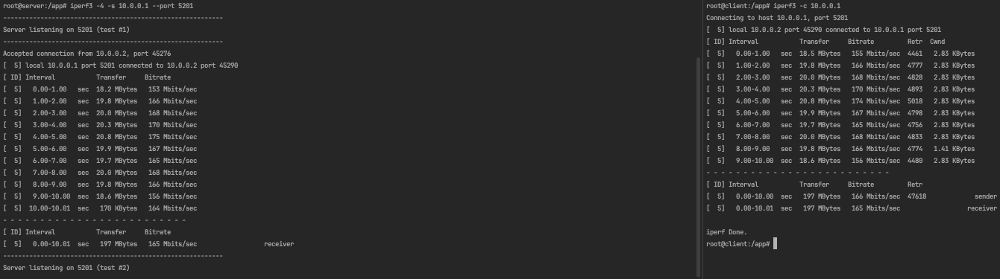

# Tunnel


## Netcat - messaging
On server:
```
nc -v -l -p 12346
nc -v -s 10.0.0.1 -l -p 12346
```

On client:
```
nc -v 10.0.0.1 12346
```


## Netcat - send file
On server:
````
nc -v -s 10.0.0.1 -l -p 12346 | pv > testfile
````
I got speed 1000MiB 0:01:05 [15.3MiB/s] directly from client container to server container in docker network.

On client:
````
nc 10.0.0.1 12346 < testfile
````

## Schema


## Speed test with iperf3
On server:
```
iperf3 -4 -s 10.0.0.1 --port 5201
```

On client:
```
iperf3 -c 10.0.0.1
```

