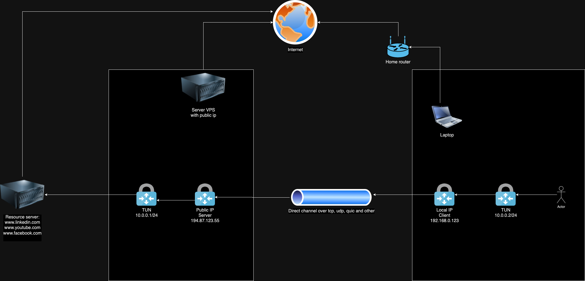

# Tunnel


## Netcat - messaging
On server:
```
nc -v -l -p 12346
nc -v -s 10.0.0.1 -l -p 12346
```

On client:
```
nc -v 10.0.0.1 12346
```


## Netcat - send file
On server:
```
nc -l -p 12346 > file.txt
```

On client:
```
nc 10.0.0.1 12346 < file.txt
```


## TCP-dump check tcp
Port 1234 is the port between the server and the client, i.e. the tunnel.
```
tcpdump -i eth0 'tcp and port 1234 and (((ip[2:2] - ((ip[0]&0xf)<<2)) - ((tcp[12]&0xf0)>>2)) != 0)' -X -vv
```


## Static routing on macos
```
route -n add -host 34.160.111.145 -interface utun4
route -n add 0.0.0.0/0 -interface utun4
route -n add 0.0.0.0/0 -interface utun4 10
route -n get 34.160.111.145
route -n delete -host 34.160.111.145
route -n delete 0.0.0.0/0 -interface utun4
curl ifconfig.me


sudo ifconfig utun4 10.0.0.1 10.0.0.2 up
sudo route add -net 10.0.0.0/24 -interface utun4

```

## Statoc routing on linux
```
route add -net 10.0.0.0/24 -interface utun4
```


## NAT Forwarding
```
sysctl net.ipv4.ip_forward
sysctl -w net.ipv4.ip_forward=1
sysctl -w net.ipv4.ip_forward=0
sysctl -w net.ipv6.conf.all.forwarding=1

iptables -t nat -A POSTROUTING -o eth0 -j MASQUERADE
iptables -t nat -A POSTROUTING -o wlp2s0 -j MASQUERADE
iptables -A FORWARD -i tun0 -o eth0 -j ACCEPT
iptables -A FORWARD -i tun0 -o wlp2s0 -j ACCEPT
iptables -A FORWARD -i eth0 -o tun0 -m state --state RELATED,ESTABLISHED -j ACCEPT
iptables -t nat -L -v -n
iptables -L -v -n --line-numbers
iptables -t nat -L -v -n --line-numbers
iptables -t nat -D POSTROUTING 1
iptables -D FORWARD 2
```

## TCP-dump analyse
```
tcpdump -i wlp2s0 -X -vvv
tcpdump -i wlp2s0 -X -vvv 'src host 192.168.0.13 and dst host 34.117.59.81'
tcpdump -i eth0@if78 -X -vvv 'src host 10.0.0.1 and dst host 10.0.0.2'
tcpdump -i tun0 -X -vvv 'src host 10.0.0.1 and dst host 10.0.0.2'
tcpdump -i tun0 -X -vvv 'host 10.0.0.1 or host 10.0.0.2'
tcpdump -i tun0 -X -vvv 'host 10.0.0.1 or host 10.0.0.2 or 34.160.111.145'
tcpdump -i eth0 -X -vvv 'host 10.0.0.1 or host 10.0.0.2 or 34.160.111.145'
```

## Run app
```
./tunnel_linux server --config ./configs/config.server.toml
sudo go run main.go client --config ./configs/config.server.toml
```

## Schema
